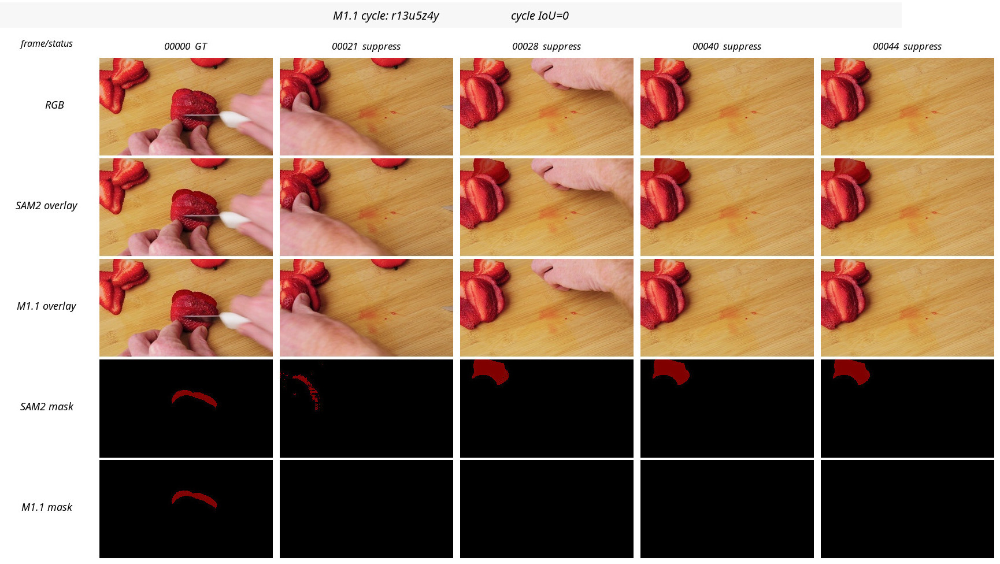
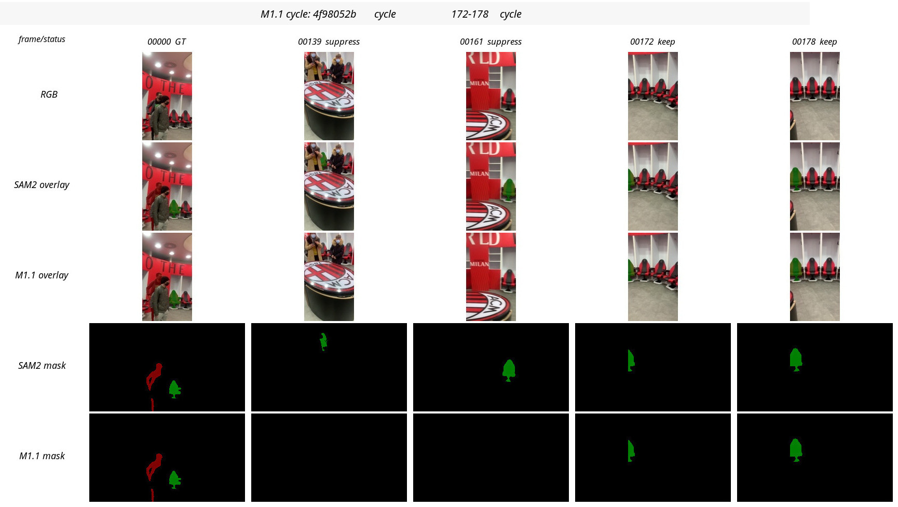
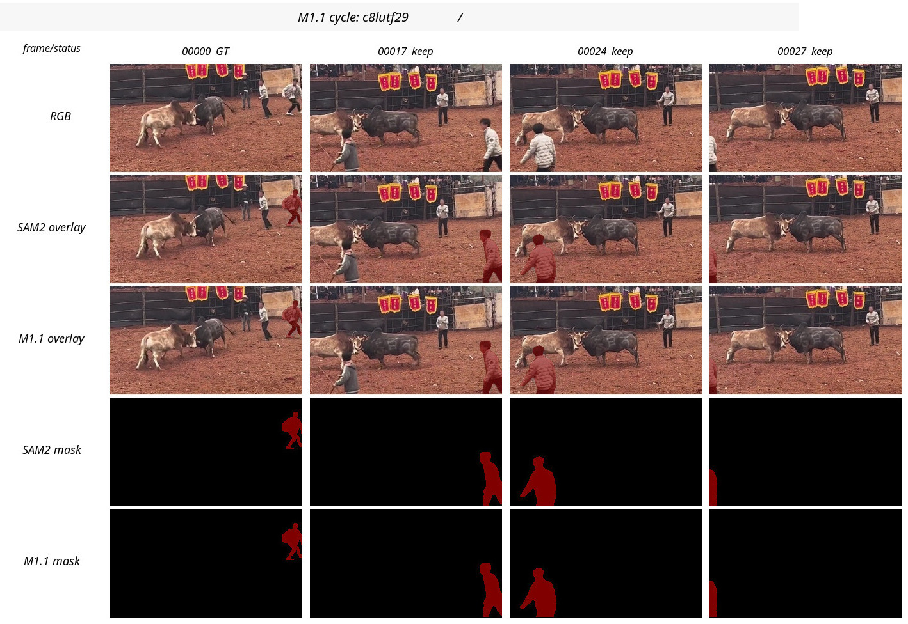
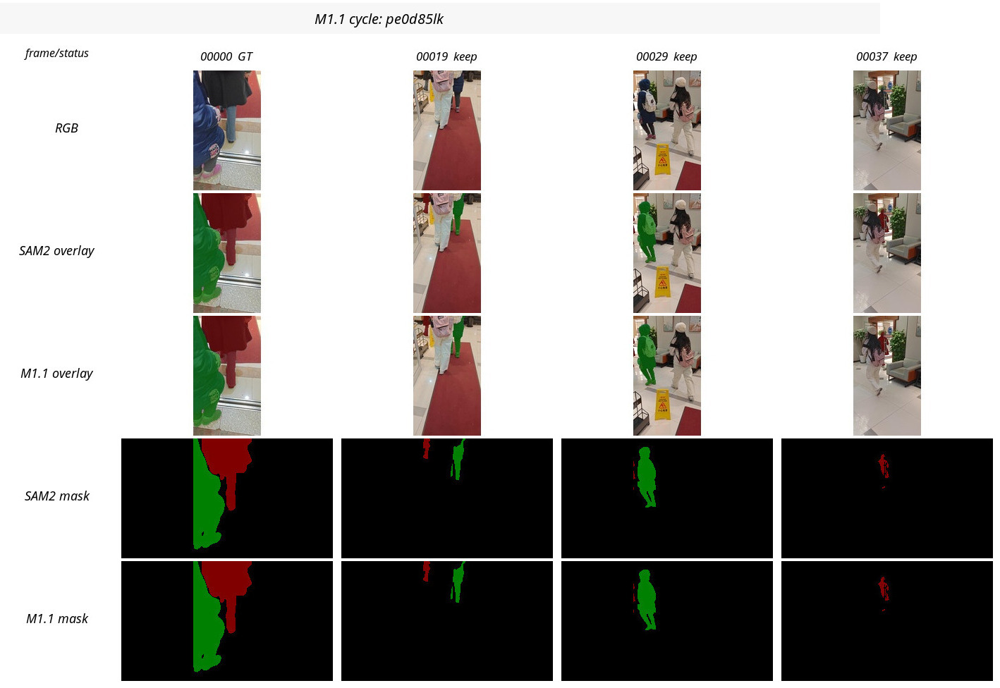
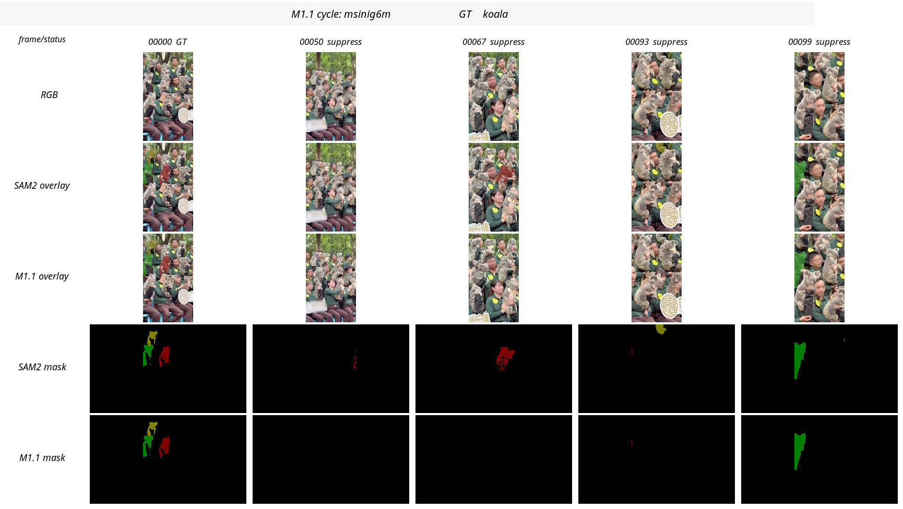

# M1.1 Training-Free Tracklet + Cycle Gate

Date: 2026-05-30  
Branch: `method/m1-1-tracklet-gate`  
Code commits: `b8a5b5d`, `f31ed3d`  
Remote audit: `/data1/yuzhixiang/cv_mosev2/MOSEv2/homework/logs/m11_cycle_gate_latest.json`  
Remote zip: `/data1/yuzhixiang/cv_mosev2/MOSEv2/homework/submission_mosev2_m11_cycle.zip`

## Motivation

M1's broad frame-wise geometry gate was not worth preserving as a default method. It did express the right identity-protection idea, but it over-suppressed visible targets in camera-motion and edge-target cases such as `c8lutf29` and `pe0d85lk`.

M1.1 keeps the method **training-free** but makes the decision more scientific:

1. **Tracklet-level candidate generation**: only raw non-empty tracklets after raw empty gaps are considered, instead of frame-wise latching.
2. **Protection against known M1 failure modes**: edge-truncated and large targets are not suppressed by far motion alone.
3. **Frozen-SAM2 backward cycle consistency**: a suspicious candidate mask is used as a mask prompt at its reappearance frame and propagated backward to frame 0. If the result cannot recover the first-frame GT instance, the candidate is treated as a likely wrong identity.

This uses no training, no finetuning, and no learned classifier. It reuses the frozen SAM2 dynamics as an identity-consistency oracle.

## Execution

Command:

```bash
./scripts/sync_code_b101.sh
./scripts/run_b101_m11_cycle_gate.sh
```

Result:

- Videos processed: `15`
- Frames processed: `1004`
- Suppressed object-frames: `60`
- Runtime: `289.475 s`
- Submission zip: `/data1/yuzhixiang/cv_mosev2/MOSEv2/homework/submission_mosev2_m11_cycle.zip`
- Zip validation: `433` dirs, `66,526` PNGs, `testzip_bad=None`
- Local artifacts: `artifacts/m11_cycle/`

## Suppression summary

M1.1 is much narrower than M1 (`60` object-frames suppressed vs `167`). It suppresses only three videos:

| video | object summary | cycle evidence |
| --- | --- | --- |
| `r13u5z4y` | id1 23 frames: 21-37 and 39-44 | cycle IoU to first GT = `0.0`; keeps the intended strawberry hard-negative suppression |
| `4f98052b` | id2 12 frames: 139-141 and 161-169 | cycle IoU = `0.0014` and `0.0`; later 172-178 was kept because cycle IoU = `0.897` |
| `msinig6m` | id1 18 frames, id3 7 frames | cycle IoU = `0.0` for all suppressed koala candidates |

The key change is that M1.1 no longer suppresses the visually bad M1 cases:

- `c8lutf29`: preserved; edge/person motion no longer becomes empty.
- `pe0d85lk`: preserved; large/camera-motion human target no longer becomes empty.

## Visual comparison sheets

Rows in each image: frame/status, RGB, SAM2 overlay, M1.1 overlay, SAM2 mask, M1.1 mask.

- Positive candidate: [`r13u5z4y`](visuals/m11_cycle/r13u5z4y_cycle_positive.jpg)
- Mixed/verified candidate: [`4f98052b`](visuals/m11_cycle/4f98052b_cycle_mixed.jpg)
- Preserved negative-control case: [`c8lutf29`](visuals/m11_cycle/c8lutf29_cycle_preserve.jpg)
- Preserved negative-control case: [`pe0d85lk`](visuals/m11_cycle/pe0d85lk_cycle_preserve.jpg)
- Koala candidate: [`msinig6m`](visuals/m11_cycle/msinig6m_cycle_candidate.jpg)











## Interpretation

M1.1 is a much better candidate than M1 mechanistically:

- it avoids broad confidence-free/geometry-only latching;
- it explicitly tests whether a candidate can cycle back to the first-frame instance;
- it preserves the two clearest M1 false-empty regressions.

However, it is still an ablation candidate until scored. Remaining risk: if SAM2's backward cycle itself fails on a true target under severe viewpoint change, M1.1 could still suppress a valid candidate. The method is now higher precision, but not guaranteed.

## Decision

M1 should be considered superseded by M1.1 for further experiments. M1.1 cycle zip is worth submitting as a separate candidate, but not yet replacing the SAM2 baseline without score evidence.
