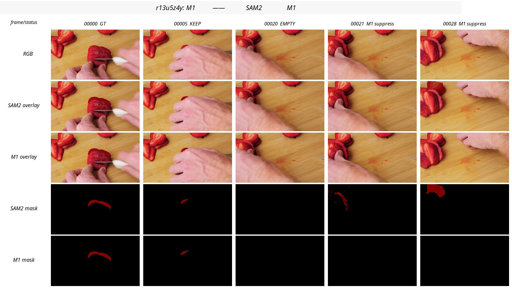
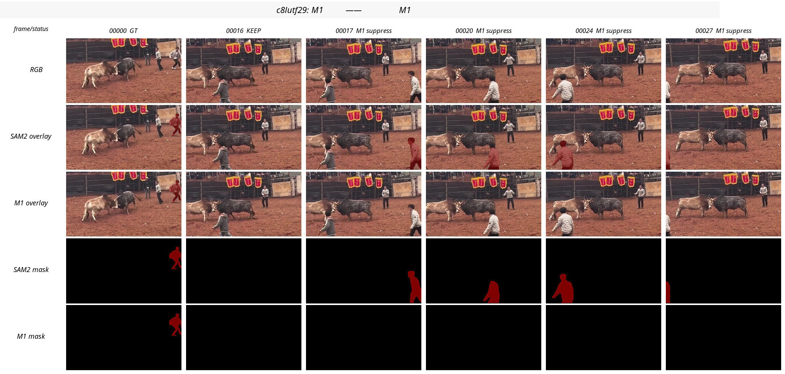
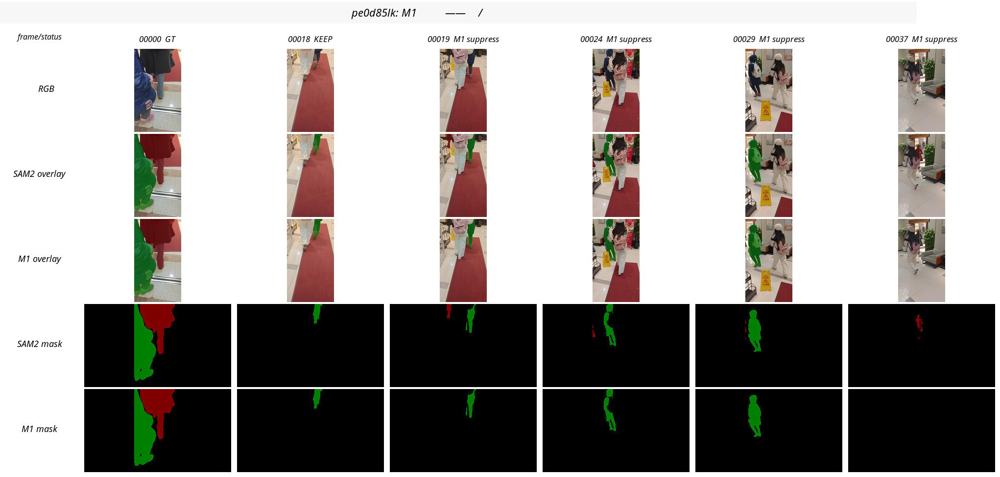
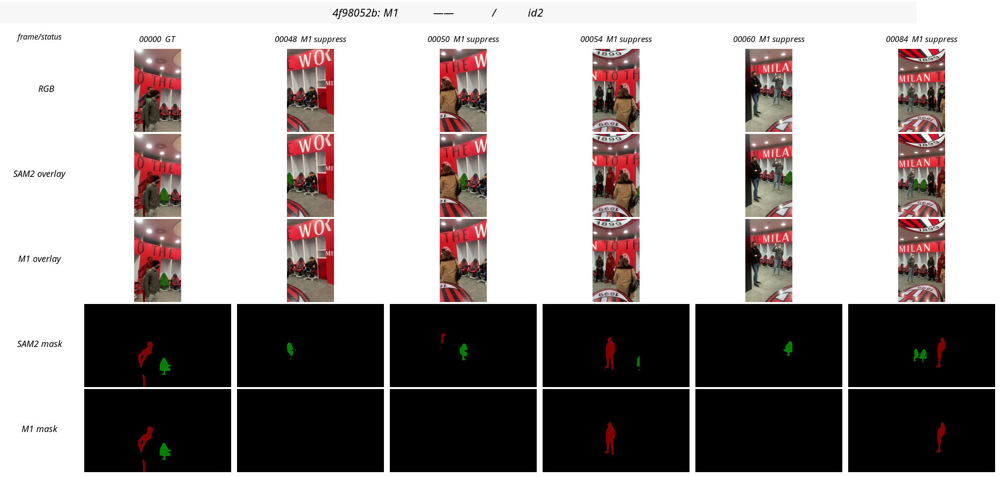

# M1 Visual Review — Visibility/Identity Gate

Date: 2026-05-29  
Branch: `method/m1-visibility-gate`  
Implementation commits: `6420d39` initial M1, `47db029` safety hardening, `0532fe8` corrupt-mask guard  
Remote audit: `/data1/yuzhixiang/cv_mosev2/MOSEv2/homework/logs/m1_visibility_gate_latest.json`  
Remote zip: `/data1/yuzhixiang/cv_mosev2/MOSEv2/homework/submission_mosev2_m1_visibility.zip`

## Visual comparison sheets

The rows in each image are: frame/status, RGB, SAM2 overlay, M1 overlay, SAM2 mask, M1 mask.

- Positive candidate: [`r13u5z4y`](visuals/m1_compare/r13u5z4y_positive_candidate.jpg)
- Negative candidate: [`c8lutf29`](visuals/m1_compare/c8lutf29_negative_candidate.jpg)
- Negative candidate: [`pe0d85lk`](visuals/m1_compare/pe0d85lk_negative_candidate.jpg)
- Uncertain/high-risk candidate: [`4f98052b`](visuals/m1_compare/4f98052b_uncertain_candidate.jpg)

## Review method

I compared original RGB frames, raw SAM2 masks, and M1 masks on the major suppressed spans. The temporary contact sheets used this row order per sampled frame:

1. frame label;
2. original RGB frame;
3. raw SAM2 overlay;
4. M1 overlay;
5. raw SAM2 label mask;
6. M1 label mask.

This review is semantic and visual, not a substitute for Codabench. I mark uncertainty explicitly when the original target identity cannot be resolved confidently from the sampled frames.

## Global M1 result

- Processed videos: `15`
- Processed frames: `1004`
- Suppressed object-frames: `167`
- Latest validated b101 run: `117.025 s`
- Submission validation: `433` video dirs, `66,526` PNGs, `testzip_bad=None`

Suppression is concentrated in a small set of videos:

| video | suppression summary | preliminary visual judgment |
| --- | --- | --- |
| `r13u5z4y` | id1 23 frames, 21-44 | likely helpful / identity-protective |
| `c8lutf29` | id1 11 frames, 17-27 | likely harmful: target person appears visible |
| `pe0d85lk` | id1 19 frames, 19-43 | likely harmful: visible walking person/camera-motion case |
| `4f98052b` | id2 75 frames, 48-178 | high uncertainty / high over-suppression risk |
| `2smf7uq9` | id1 15 frames, 28-42 | uncertain: multiple flamingos, identity hard |
| `msinig6m` | id1/id3 21 frames total | mixed/uncertain: many koalas/humans and tiny masks |
| `q0sizv6m` | id2 2 frames, 13-14 | small effect, identity still ambiguous |

## Per-video observations

### `r13u5z4y` — likely positive

The first-frame target is a partly visible strawberry slice. Around frame `00005` it is heavily occluded by the hand; around `00020` the raw SAM2 output is empty; from `00021` onward raw SAM2 produces masks on visible strawberry pieces near the left stack / previously visible slices.

M1 suppresses those post-gap masks. This matches the original failure attribution: after full hand occlusion and reappearance among many visually similar strawberry pieces, a confident mask on the wrong slice is worse than an empty mask. Remaining uncertainty: the true slice may have been moved and set down near other slices, so exact identity still requires dense frame-by-frame human confirmation.

### `c8lutf29` — likely negative

The first-frame target is the person near the right image edge. In later sampled frames (`00017`, `00020`, `00024`, `00027`), a person with similar role/trajectory is visible in or near the right/bottom/left edge region. Raw SAM2 follows a person-shaped mask; M1 turns these masks empty because the target reappears far from the old position after an invisible gap.

This is probably a false-empty regression: M1 mistakes camera/person motion and edge movement for identity drift. This video is strong evidence that the global distance gate is too broad.

### `pe0d85lk` — likely negative

The scene contains large edge-truncated people and strong camera/subject motion. Raw SAM2 continues to produce masks on a visible walking person over frames `00019`, `00024`, `00029`, and `00037`. M1 suppresses id1 after frame `00019`, leaving empty output for a target that appears semantically visible.

This is the clearest over-suppression pattern: large target, moving camera, and changing crop position make centroid distance unreliable.

### `4f98052b` — high uncertainty / high risk

M1 suppresses id2 for 75 frames. The scene has strong camera motion and repeated red/black chair-like objects. It is plausible that raw SAM2 sometimes jumps to a wrong repeated object, but the suppression span is too long to trust without closer identity review. Because this video has many repeated objects and changing perspective, M1's fixed post-gap distance rule is under-supported.

Conclusion: do not use this broad suppression unless frame-level semantic review confirms the raw id2 is consistently wrong.

### `2smf7uq9` — uncertain

Multiple flamingos with similar color and shape appear, and the raw SAM2 mask after frame `00028` may be a same-class distractor. M1 suppresses frames `00028`-`00042`. The identity is hard to verify from sparse samples: this may be correct identity protection, or it may remove a true visible flamingo. Needs a denser trajectory review before promotion.

### `msinig6m` — mixed / uncertain

The koala/person scene has many similar koalas, heavy occlusion, and small/partial masks. Some suppressed raw masks look tiny or implausible, so M1 may help locally. But the same weakness remains: it lacks an explicit identity confirmation path, so it can also suppress true reappearances.

### `q0sizv6m` — small effect, still ambiguous

Only two id2 frames are suppressed. Multiple guinea pigs are near each other, and raw SAM2 itself likely has identity ambiguity. M1 does not solve the deeper multi-instance competition problem here.

## Why M1 behaves this way

M1 implements a useful principle but uses weak proxies:

1. **No camera-motion compensation.** A true object can reappear far from its old centroid after camera pan or subject/camera motion.
2. **No semantic re-identification.** RGB histogram, area, and centroid do not decide whether a later object is the same first-frame instance.
3. **Suppression latches.** A suppressed frame increments the invisible gap but does not update the confirmed anchor, so later candidates are compared against an increasingly stale state.
4. **Static thresholds ignore object class and size.** Tiny targets, large edge-truncated people, and repeated chairs/flamingos need different priors.
5. **No cross-id or hard-negative reasoning.** The method does not compare competing candidates or use negative examples from likely distractors.

## Decision

Do **not** promote M1 as the default or “better” submission. Keep its zip as an ablation candidate only.

M1 should not be discarded completely: it expresses the right identity-protection insight and likely helps `r13u5z4y`. But the current global gate is too blunt for the full 15-video set.

## Recommended next step: M1.1 before M2

Do a narrower M1.1 instead of jumping directly to M2:

1. restrict hard suppression to visually confirmed identity-switch spans first, especially `r13u5z4y`;
2. exclude or greatly loosen high-camera-motion/large-target cases like `pe0d85lk` and likely `4f98052b` id2;
3. separate `raw_empty_gap` from `suppressed_gap` to avoid self-reinforcing stale anchors;
4. add a pending-reappearance state: accept a far candidate only after short temporal stability, or suppress only after repeated evidence of wrong identity;
5. add per-video/object risk tags, so M1.1 is a targeted intervention rather than one global rule;
6. only then use accepted high-confidence frames as M2 pseudo anchors.

M2 should wait because multi-anchor re-prompting can poison SAM2 memory if the pseudo anchors are already identity-switched.
